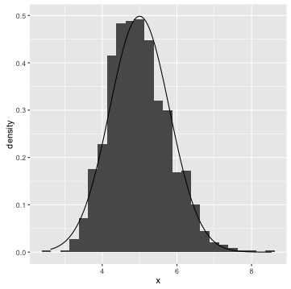

# Statistical Inference Coursera Project

Shuo 9th April 2016

## Overview
The main goal of this report is to investigate the exponential distribution in R and compare it with the Central Limit Theorem (CLT).

Here is the introduction of the Part one of the assignment:
The exponential distribution can be simulated in R with rexp(n, lambda) where lambda is the rate parameter. The mean of exponential distribution is 1/lambda and the standard deviation is also 1/lambda. Set lambda = 0.2 for all of the simulations. You will investigate the distribution of averages of 40 exponentials. Note that you will need to do a thousand simulations.

Illustrate via simulation and associated explanatory text the properties of the distribution of the mean of 40 exponentials. You should

Show the sample mean and compare it to the theoretical mean of the distribution.
Show how variable the sample is (via variance) and compare it to the theoretical variance of the distribution.
Show that the distribution is approximately normal.

## Simulations
Running a 1000 Simulations of 40 exponentials.
```r
set.seed(555)
lambda <- 0.2 
nosim <- 1:1000 # Number of Simulations/rows
n <- 40 

#sd(apply(matrix(rnorm(nosim*n), nosim), 1, mean))
#Create a matrix of simulated values:
expMatrix <- data.frame(x = sapply(nosim, function(x) {mean(rexp(n, lambda))}))
head(expMatrix)
```
```result
         x
1 3.787801
2 5.149173
3 5.151321
4 5.551848
5 3.962165
6 4.804689
```
#### 1. Show the sample mean and compare it to the theoretical mean of the distribution.

```R
sMeanExp <- apply(expMatrix, 2, mean)
sMeanExp
```
```
       x 
4.987831 
```
The center of simulated distribution is 4.987831.

Expected the theoretical center of the distribution:
```r
tMeanExp <- 1/lambda
tMeanExp
```
>>[1] 5

The sMeanExp is very close to the expected theoretical center of the distribution.

#### 2. Show how variable the sample is (via variance) and compare it to the theoretical variance of the distribution.
The simulated Standard Deviation and Variance are:
```r
simSDExp <- sd((expMatrix$x))
simSDExp
[1] 0.8001359
simVarExp <- var(expMatrix$x)
simVarExp
[1] 0.6402174
```
Compare the expected theretical Sstandard deviation and Variance:
```r
theoSdExp <- (1/lambda)/sqrt(n)
theoSdExp
[1] 0.7905694
theoVarExp <- theoSdExp^2
theoVarExp
[1] 0.625
```
The differences are minimal which are expected.

#### 3. Show that the distribution is approximately normal.
```r
install.packages("ggplot2")

library(ggplot2)
ggplot(data = expMatrix, aes(x = x)) + 
  geom_histogram(aes(y=..density..), binwidth = 0.25) +
  stat_function(fun = dnorm, args = list(mean = tMeanExp, sd = sd(expMatrix$x)))
```


The averages of samples will follow a normal distribution. The ploting above shows the distribution is approximately normal.


